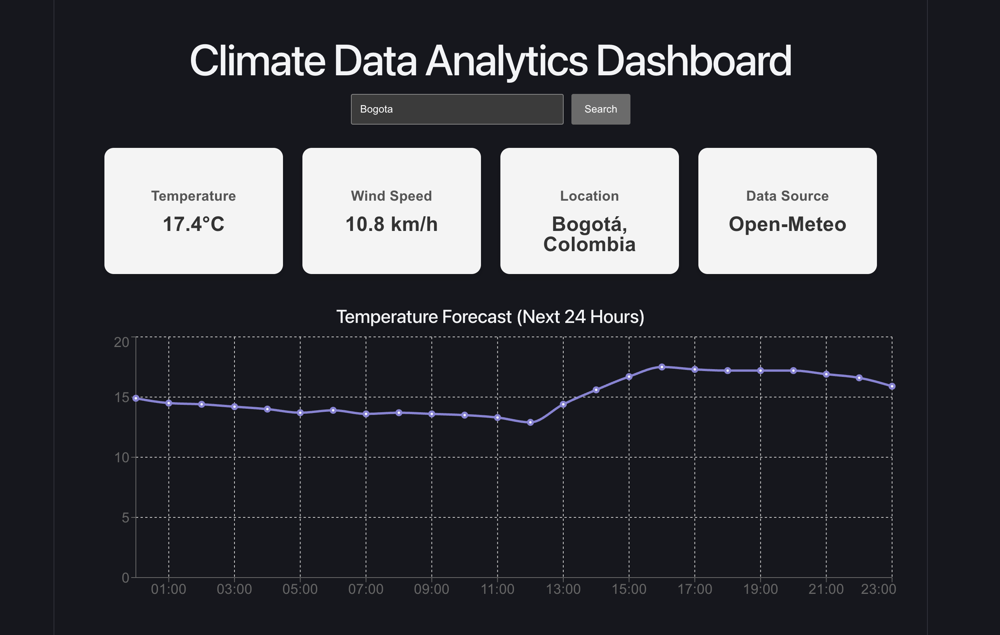

# Climate Data Analytics Dashboard



A modern React dashboard that visualizes real-time climate data using external APIs and interactive charts.

---

## Technologies Used


---

## Features

- Search weather by city
- Display real-time temperature and wind speed
- Interactive temperature chart for the next 24 hours
- Dynamic dashboard metric cards
- Animated data visualization

---

## How It Works

1. The user enters a city name.
2. The Geocoding API converts the city name into geographic coordinates.
3. The Weather API retrieves climate data based on those coordinates.
4. The dashboard updates the chart and metric cards dynamically.

---

## Installation

Clone the repository:

```
git clone https://github.com/yailinpvdev/climate-data-analytics-dashboard.git
```

Go to the project folder:

```
cd climate-data-analytics-dashboard
```

Install dependencies:

```
npm install
```

Run the development ser
